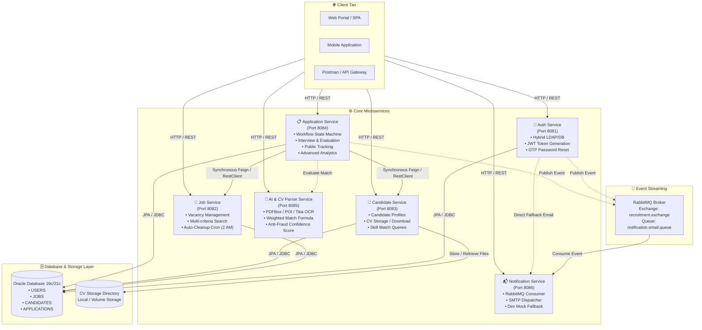
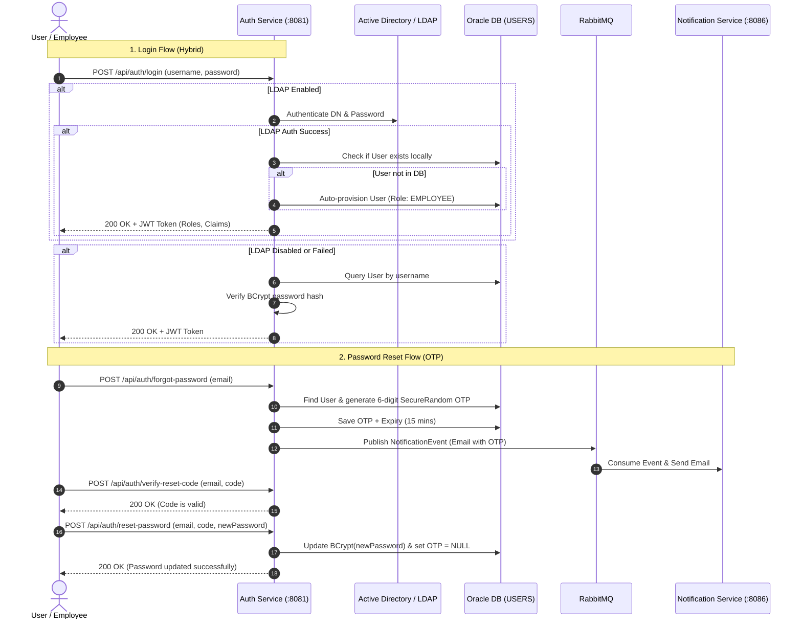
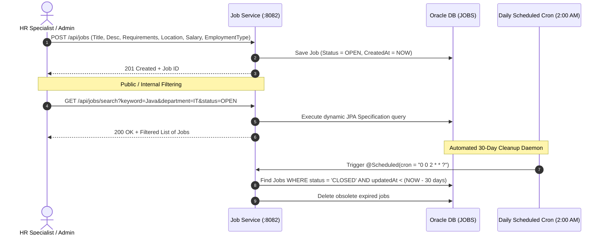
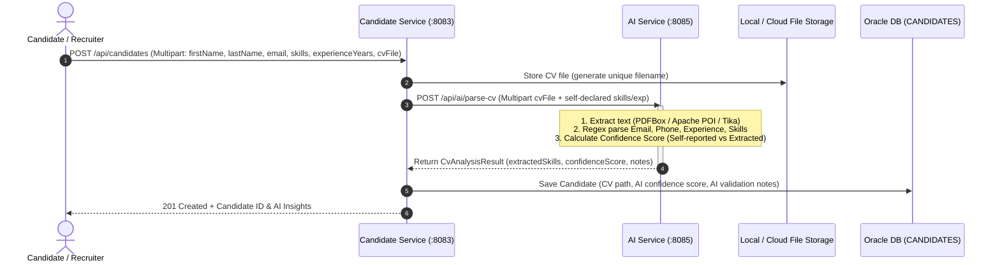
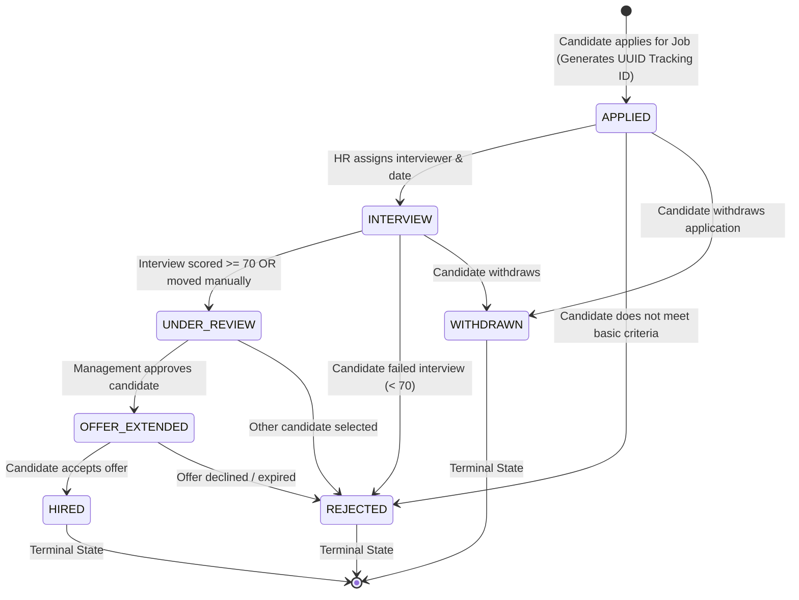
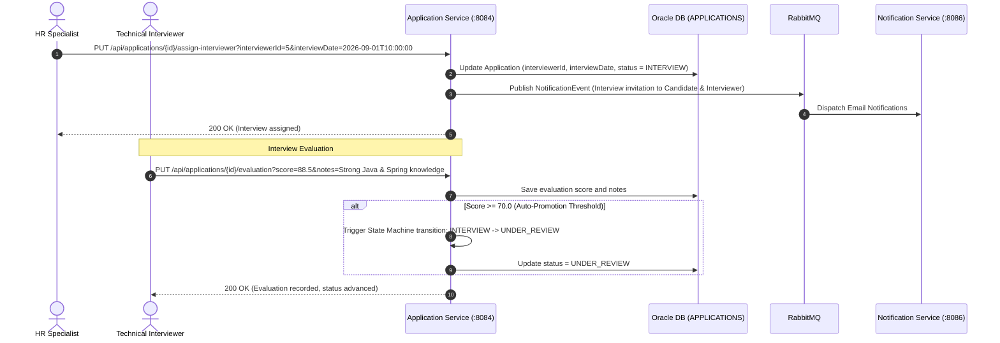
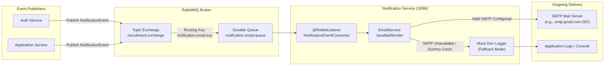
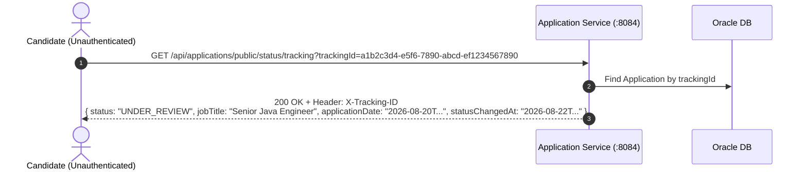
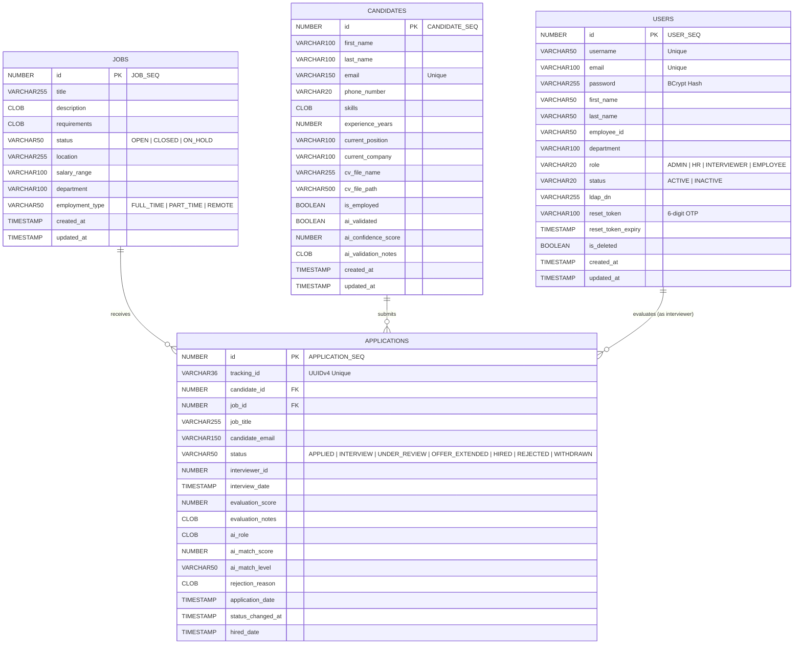

# 🏢 Enterprise HR Recruitment & Talent Acquisition Platform

[](https://www.oracle.com/java/)
[](https://spring.io/projects/spring-boot)
[](https://spring.io/projects/spring-security)
[](https://www.oracle.com/database/)
[](https://www.rabbitmq.com/)
[](https://www.docker.com/)
[](https://gradle.org/)
[](https://swagger.io/)

---

## 📑 Table of Contents

1. [Executive Overview](#-executive-overview)
2. [Key System Capabilities](#-key-system-capabilities)
3. [Technology Stack & Architecture Principles](#-technology-stack--architecture-principles)
4. [High-Level Microservices Architecture](#-high-level-microservices-architecture)
5. [End-to-End Business Flows & Workflows](#-end-to-end-business-flows--workflows)
   - [5.1 Authentication, LDAP Sync & Password Recovery](#51-authentication-ldap-sync--password-recovery)
   - [5.2 Job Posting & Automated Lifecycle Management](#52-job-posting--automated-lifecycle-management)
   - [5.3 Candidate Ingestion, CV OCR & AI Validation](#53-candidate-ingestion-cv-ocr--ai-validation)
   - [5.4 Job Application Workflow & State Machine](#54-job-application-workflow--state-machine)
   - [5.5 Interview Scheduling, Evaluation & Auto-Progression](#55-interview-scheduling-evaluation--auto-progression)
   - [5.6 Asynchronous Notification & Event Broker Pipeline](#56-asynchronous-notification--event-broker-pipeline)
   - [5.7 Candidate Self-Service Public Tracking](#57-candidate-self-service-public-tracking)
6. [Detailed Breakdown of the 6 Microservices](#-detailed-breakdown-of-the-6-microservices)
   - [6.1 Auth Service (`:8081`)](#61-auth-service-port-8081)
   - [6.2 Job Service (`:8082`)](#62-job-service-port-8082)
   - [6.3 Candidate Service (`:8083`)](#63-candidate-service-port-8083)
   - [6.4 Application Service (`:8084`)](#64-application-service-port-8084)
   - [6.5 AI & CV Parser Service (`:8085`)](#65-ai--cv-parser-service-port-8085)
   - [6.6 Notification Service (`:8086`)](#66-notification-service-port-8086)
7. [AI Matching Algorithm & OCR Engine](#-ai-matching-algorithm--ocr-engine)
8. [Database Schema & Entity Relationship Model](#-database-schema--entity-relationship-model)
9. [Security, Identity & RBAC Matrix](#-security-identity--rbac-matrix)
10. [Event-Driven Messaging (RabbitMQ Topology)](#-event-driven-messaging-rabbitmq-topology)
11. [Complete API Catalog & Reference](#-complete-api-catalog--reference)
12. [Environment Configuration Reference](#-environment-configuration-reference)
13. [Quick Start & Deployment Guide](#-quick-start--deployment-guide)
    - [13.1 Local Scripted Deployment (Windows)](#131-local-scripted-deployment-windows)
    - [13.2 Docker Compose Deployment](#132-docker-compose-deployment)
    - [13.3 Manual Gradle Commands](#133-manual-gradle-commands)
14. [Testing & Quality Assurance](#-testing--quality-assurance)
15. [Postman Collections](#-postman-collections)
16. [Project Directory Layout](#-project-directory-layout)

---

## 🌟 Executive Overview

The **Enterprise HR Recruitment & Talent Acquisition Platform** is a distributed, event-driven, production-grade microservices system engineered to modernize, automate, and accelerate the complete talent acquisition lifecycle. 

From vacancy creation, talent sourcing, multi-format CV parsing (PDF, Word DOC/DOCX), intelligent algorithmic candidate-job matching, candidate tracking, and interview scoring, to asynchronous notifications—the platform provides a robust, decoupled, and highly scalable enterprise architecture.

```
                              ┌───────────────────────────────────┐
                              │      Frontend / Web / Mobile      │
                              └─────────────────┬─────────────────┘
                                                │ (REST / JSON)
                                                ▼
     ┌─────────────────────────────────────────────────────────────────────────────────────┐
     │                                 MICROSERVICES LAYER                                 │
     │                                                                                     │
     │   ┌──────────────┐    ┌──────────────┐    ┌──────────────┐    ┌──────────────┐      │
     │   │     Auth     │    │     Job      │    │  Candidate   │    │ Application  │      │
     │   │   Service    │    │   Service    │    │   Service    │    │   Service    │      │
     │   │   (:8081)    │    │   (:8082)    │    │   (:8083)    │    │   (:8084)    │      │
     │   └──────┬───────┘    └──────┬───────┘    └──────┬───────┘    └──────┬───────┘      │
     │          │                   │                   │                   │              │
     │          │                   │                   │            ┌──────┴──────┐       │
     │          │                   │                   │            │             │       │
     │          ▼                   ▼                   ▼            ▼             ▼       │
     │   ┌────────────────────────────────────────────────────────┐  │    ┌──────────────┐ │
     │   │            Oracle Database (19c / 21c)                 │  │    │  AI Service  │ │
     │   │       USERS | JOBS | CANDIDATES | APPLICATIONS         │  │    │   (:8085)    │ │
     │   └────────────────────────────────────────────────────────┘  │    └──────────────┘ │
     │                                                               │                     │
     │                                                               │ (AMQP / REST)       │
     │                                                               ▼                     │
     │                                                   ┌───────────────────────┐         │
     │                                                   │      RabbitMQ         │         │
     │                                                   │  recruitment.exchange │         │
     │                                                   └───────────┬───────────┘         │
     │                                                               │                     │
     │                                                               ▼                     │
     │                                                   ┌───────────────────────┐         │
     │                                                   │ Notification Service  │         │
     │                                                   │        (:8086)        │         │
     │                                                   │  (SMTP / Mock Engine) │         │
     │                                                   └───────────────────────┘         │
     └─────────────────────────────────────────────────────────────────────────────────────┘
```

---

## 🚀 Key System Capabilities

- 🔐 **Enterprise Identity & Hybrid Authentication**: Dual-mode login supporting central LDAP / Active Directory servers with automatic database user provisioning, fallback to local Oracle database with `BCrypt` password hashing, and stateless `HMAC-SHA256` JWT issuance.
- 🔑 **Cryptographic Password Recovery**: Time-bound 6-digit OTP generation using `SecureRandom` with a 15-minute Time-to-Live (TTL), single-use invalidation, and asynchronous email delivery.
- 📄 **Deep Resume Parsing (OCR/NLP)**: Multi-engine document processing using **Apache PDFBox**, **Apache POI**, and **Apache Tika** to extract candidate names, contact details, structured skill sets, and work experience years from `.pdf`, `.docx`, and `.doc` files.
- 🎯 **Algorithmic Candidate-Job Matching**: Multi-criteria weighted mathematical scoring engine evaluating technical skill overlap ($60\%$), experience level alignment ($30\%$), and job title relevance ($10\%$).
- 🔄 **Strict Application Workflow State Machine**: Controlled lifecycle transitions (`APPLIED` $\rightarrow$ `INTERVIEW` $\rightarrow$ `UNDER_REVIEW` $\rightarrow$ `OFFER_EXTENDED` $\rightarrow$ `HIRED` / `REJECTED` / `WITHDRAWN`) preventing invalid status mutations.
- 📊 **Interview Scoring & Automatic Progression**: Integrated interview scheduling and scoring system with threshold-based automated advancement (scores $\ge 70$ auto-promote to `UNDER_REVIEW`).
- 🔍 **Public Candidate Self-Service Tracking**: Zero-login, instant application status tracking using secure, non-guessable `UUIDv4` tracking IDs (`X-Tracking-ID`).
- ⚡ **Asynchronous Event-Driven Notifications**: Non-blocking email dispatching powered by **RabbitMQ** message broker with automatic fallback to logging mode for development environments.
- 🧹 **Automated Database Housekeeping**: Daily Spring Cron daemon (`@Scheduled`) purging expired and closed job listings older than 30 days.

---

## 🛠️ Technology Stack & Architecture Principles

| Domain | Technology / Library | Version | Purpose & Architectural Role |
| :--- | :--- | :--- | :--- |
| **Language** | **Java** | `Java 21 LTS` | Modern Java features (Virtual Threads ready, Pattern Matching, Records). |
| **Framework** | **Spring Boot** | `3.4.0` | Microservice foundation, dependency injection, and REST endpoints. |
| **Data Access** | **Spring Data JPA / Hibernate** | `6.x` | ORM mapping, sequence generation, and `CLOB` text storage handling. |
| **Database** | **Oracle Database** | `19c / 21c` | ACID enterprise relational store with database-level sequence generators. |
| **Database Driver**| **Oracle JDBC (`ojdbc11`)** | `Latest` | High-performance JDBC connectivity with connection pooling. |
| **Security** | **Spring Security** | `6.x` | Stateless filter chains, CORS configuration, and method security. |
| **JWT Token** | **JJWT (Java JWT)** | `0.11.5` | Cryptographic JWT token generation, claims extraction, and signature validation. |
| **Enterprise Auth**| **Spring Security LDAP** | `3.4.0` | Active Directory and OpenLDAP directory authentication. |
| **Message Broker** | **RabbitMQ / Spring AMQP** | `3.13` | Asynchronous decoupled message queuing via Topic Exchanges. |
| **PDF Extraction** | **Apache PDFBox** | `2.0.29` | Text layout extraction and stream parsing for PDF resumes. |
| **Office Parsing** | **Apache POI & POI-OOXML**| `5.2.3` | Word processing document extraction (`.doc`, `.docx`). |
| **Document Tika** | **Apache Tika Core / Parsers**| `2.9.0` | MIME-type detection and unified fallback text indexing. |
| **Email Protocol** | **Spring Mail / Jakarta Mail**| `Jakarta Mail`| Asynchronous SMTP email dispatching with HTML template support. |
| **API Docs** | **Springdoc OpenAPI (Swagger)**| `2.x` | Interactive REST API testing UI on all 6 microservices. |
| **Boilerplate** | **Project Lombok** | `1.18.x` | Annotation-driven boilerplate reduction (`@Getter`, `@Builder`, `@Slf4j`). |
| **Containerization**| **Docker & Docker Compose** | `v2+` | Multi-container Alpine Linux images (`eclipse-temurin:21-jre-alpine`). |
| **Build Tool** | **Gradle (Kotlin DSL)** | `8.x` | Multi-module build orchestration (`build.gradle.kts`, `settings.gradle.kts`). |

---

## 🏛️ High-Level Microservices Architecture

The system is designed with strict **Separation of Concerns (SoC)** and follows cloud-native microservice architecture standards:



---

## 🔄 End-to-End Business Flows & Workflows

### 5.1 Authentication, LDAP Sync & Password Recovery



---

### 5.2 Job Posting & Automated Lifecycle Management



---

### 5.3 Candidate Ingestion, CV OCR & AI Validation



---

### 5.4 Job Application Workflow & State Machine



---

### 5.5 Interview Scheduling, Evaluation & Auto-Progression



---

### 5.6 Asynchronous Notification & Event Broker Pipeline



---

### 5.7 Candidate Self-Service Public Tracking



---

## 🧩 Detailed Breakdown of the 6 Microservices

```
┌─────────────────────────────────────────────────────────────────────────────────────────────┐
│                                   MICROSERVICES MATRIX                                      │
├─────────────────────┬────────┬─────────────────────────┬──────────────────┬─────────────────┤
│ Service Name        │ Port   │ Context Path            │ Primary Database │ Primary Broker  │
├─────────────────────┼────────┼─────────────────────────┼──────────────────┼─────────────────┤
│ Auth Service        │ 8081   │ /api/auth               │ Oracle (USERS)   │ RabbitMQ Pub    │
│ Job Service         │ 8082   │ /api/jobs               │ Oracle (JOBS)    │ -               │
│ Candidate Service   │ 8083   │ /api/candidates         │ Oracle (CAND)    │ -               │
│ Application Service │ 8084   │ /api/applications       │ Oracle (APPS)    │ RabbitMQ Pub    │
│ AI Service          │ 8085   │ /api/ai                 │ Stateless        │ -               │
│ Notification Service│ 8086   │ /api/notifications      │ Stateless        │ RabbitMQ Sub    │
└─────────────────────┴────────┴─────────────────────────┴──────────────────┴─────────────────┘
```

---

### 6.1 Auth Service (Port: `8081`)

The **Auth Service** is the perimeter security gateway and identity provider for the entire recruitment ecosystem.

- **Responsibilities**:
  - Secure user registration with BCrypt hashing (`10` salt rounds).
  - Hybrid authentication: Queries LDAP / Active Directory first; falls back to local database.
  - Automatic LDAP user provisioning: Syncs new LDAP users to the database with the `EMPLOYEE` role.
  - JWT token generation, signature with `HS256`, and role claim encapsulation.
  - 6-digit cryptographic OTP generation for password resets with a 15-minute TTL.
  - Dispatches OTP reset codes asynchronously via RabbitMQ to the Notification Service.
- **Key Source Files**:
  - [`AuthController.java`](file:///c:/Users/Hossam/Downloads/project/services/services/auth/src/main/java/com/services/auth/controller/AuthController.java) — REST endpoints for login, register, password reset.
  - [`AuthService.java`](file:///c:/Users/Hossam/Downloads/project/services/services/auth/src/main/java/com/services/auth/service/AuthService.java) — Core business logic, token creation, OTP verification.
  - [`LdapAuthService.java`](file:///c:/Users/Hossam/Downloads/project/services/services/auth/src/main/java/com/services/auth/service/LdapAuthService.java) — Spring Security LDAP directory communication.
  - [`JwtService.java`](file:///c:/Users/Hossam/Downloads/project/services/services/auth/src/main/java/com/services/auth/service/JwtService.java) — Token encoding, decoding, validation.
  - [`RabbitMQConfig.java`](file:///c:/Users/Hossam/Downloads/project/services/services/auth/src/main/java/com/services/auth/config/RabbitMQConfig.java) — Topic exchange and routing key definitions.

---

### 6.2 Job Service (Port: `8082`)

The **Job Service** manages the corporate job catalog, vacancy lifecycles, and search indexing.

- **Responsibilities**:
  - CRUD operations on job vacancies (Title, Description, Requirements, Department, Location, Salary Range, Employment Type).
  - Multi-dimensional search using Spring Data JPA Specifications (filter by keyword, department, location, employment type, status).
  - Vacancy lifecycle management (`OPEN`, `CLOSED`, `ON_HOLD`).
  - **Automated Purge Daemon (`JobCleanupService`)**: Runs daily at 2:00 AM via cron expression `@Scheduled(cron = "0 0 2 * * ?")` to delete closed jobs older than 30 days.
- **Key Source Files**:
  - [`JobController.java`](file:///c:/Users/Hossam/Downloads/project/services/services/job/src/main/java/com/services/job/controller/JobController.java) — REST endpoints for job creation, search, status updates.
  - [`JobService.java`](file:///c:/Users/Hossam/Downloads/project/services/services/job/src/main/java/com/services/job/service/JobService.java) — Job business logic and JPA Specifications.
  - [`JobCleanupService.java`](file:///c:/Users/Hossam/Downloads/project/services/services/job/src/main/java/com/services/job/service/JobCleanupService.java) — Scheduled cron task for 30-day cleanup.
  - [`JobSpecification.java`](file:///c:/Users/Hossam/Downloads/project/services/services/job/src/main/java/com/services/job/repository/JobSpecification.java) — Dynamic criteria queries.

---

### 6.3 Candidate Service (Port: `8083`)

The **Candidate Service** manages the global talent pool, candidate profiles, and resume document storage.

- **Responsibilities**:
  - Ingestion of candidate profiles via JSON or `multipart/form-data` with CV upload.
  - File storage abstraction: Persists CV files locally or to shared volumes with unique timestamped identifiers.
  - Endpoints to download/stream candidate CV documents (`/api/candidates/{id}/cv`).
  - Skills and experience searching (`findBySkillsContainingIgnoreCase`).
  - Storage of AI validation flags (`aiValidated`, `aiConfidenceScore`, `aiValidationNotes`).
- **Key Source Files**:
  - [`CandidateController.java`](file:///c:/Users/Hossam/Downloads/project/services/services/candidate/src/main/java/com/services/candidate/controller/CandidateController.java) — Endpoints for candidate ingestion, queries, and CV download.
  - [`CandidateService.java`](file:///c:/Users/Hossam/Downloads/project/services/services/candidate/src/main/java/com/services/candidate/service/CandidateService.java) — Candidate lifecycle management.
  - [`FileStorageService.java`](file:///c:/Users/Hossam/Downloads/project/services/services/candidate/src/main/java/com/services/candidate/service/FileStorageService.java) — Multipart file persistence and resource loading.

---

### 6.4 Application Service (Port: `8084`)

The **Application Service** is the central workflow orchestrator connecting Candidates to Jobs, managing interviews, evaluations, and hiring metrics.

- **Responsibilities**:
  - Application submission with duplicate submission validation (`existsByCandidateIdAndJobId`).
  - Automatic `UUIDv4` tracking ID generation on creation.
  - **State Machine Enforcement (`ApplicationStatusMachine`)**: Validates allowed status transitions.
  - Interviewer assignment and interview scheduling.
  - Interview evaluation recording with **Auto-Promotion Logic** (score $\ge 70 \rightarrow \text{UNDER\_REVIEW}$).
  - Asynchronous event publishing to RabbitMQ for interview invites, status changes, and offers.
  - **Executive Analytics Dashboard (`/api/applications/stats`)**: Computes total applications, status distribution, average AI score, max AI score, hiring success rate ($\%$), and recent application counts.
  - Public status tracking endpoints (by Tracking ID or email + jobId).
- **Key Source Files**:
  - [`ApplicationController.java`](file:///c:/Users/Hossam/Downloads/project/services/services/application/src/main/java/com/services/application/controller/ApplicationController.java) — Complete application REST API.
  - [`ApplicationService.java`](file:///c:/Users/Hossam/Downloads/project/services/services/application/src/main/java/com/services/application/service/ApplicationService.java) — Workflow orchestration, stats computation.
  - [`ApplicationStatusMachine.java`](file:///c:/Users/Hossam/Downloads/project/services/services/application/src/main/java/com/services/application/service/ApplicationStatusMachine.java) — State transition validation matrix.

---

### 6.5 AI & CV Parser Service (Port: `8085`)

The **AI Service** is a stateless NLP and document processing microservice providing intelligent document analysis and candidate-to-job matching.

- **Responsibilities**:
  - **Multi-Format Document OCR / Text Extraction**:
    - **Apache PDFBox**: Extracts structured text streams from PDF files.
    - **Apache POI**: Reads Word document formats (`.doc`, `.docx`).
    - **Apache Tika**: Universal fallback for text, RTF, and plain documents.
  - **CV Entity & Pattern Recognition**:
    - Extracts email addresses using regex (`EMAIL_PATTERN`).
    - Extracts candidate name from header segments.
    - Identifies technical skills through token matching.
    - Determines total years of experience from date ranges and numeric mentions.
  - **Confidence Score & Anti-Fraud Verification**: Compares self-declared candidate data against OCR-extracted text to prevent resume inflation.
  - **Algorithmic Job Matching**: Computes match scores and suitability classifications (`Excellent`, `Good`, `Moderate`, `Low`).
- **Key Source Files**:
  - [`AiController.java`](file:///c:/Users/Hossam/Downloads/project/services/services/ai/src/main/java/com/services/ai/controller/AiController.java) — Endpoints for `/api/ai/parse-cv` and `/api/ai/match`.
  - [`CvParserService.java`](file:///c:/Users/Hossam/Downloads/project/services/services/ai/src/main/java/com/services/ai/service/CvParserService.java) — Entity extraction and confidence score logic.
  - [`AiMatchingService.java`](file:///c:/Users/Hossam/Downloads/project/services/services/ai/src/main/java/com/services/ai/service/AiMatchingService.java) — Weighted matching algorithm.
  - [`TextExtractorService.java`](file:///c:/Users/Hossam/Downloads/project/services/services/ai/src/main/java/com/services/ai/service/TextExtractorService.java) — PDFBox, POI, and Tika extraction pipelines.

---

### 6.6 Notification Service (Port: `8086`)

The **Notification Service** is an asynchronous consumer and SMTP email dispatcher.

- **Responsibilities**:
  - Consumes `NotificationEvent` messages from RabbitMQ queue `notification.email.queue`.
  - Direct REST endpoint `/api/notifications/send-email` for synchronous fallback delivery.
  - Formats HTML and plain-text email bodies for OTP codes, interview schedules, and status updates.
  - **Development Mock Fallback Mode**: When running locally without a real SMTP server or with default placeholder credentials (`dummy@gmail.com`), the service gracefully logs the email to console/logs without throwing exceptions or blocking the caller.
- **Key Source Files**:
  - [`NotificationEventConsumer.java`](file:///c:/Users/Hossam/Downloads/project/services/services/notification/src/main/java/com/services/notification/consumer/NotificationEventConsumer.java) — RabbitMQ message listener.
  - [`EmailService.java`](file:///c:/Users/Hossam/Downloads/project/services/services/notification/src/main/java/com/services/notification/service/EmailService.java) — SMTP dispatching and mock fallback.
  - [`NotificationController.java`](file:///c:/Users/Hossam/Downloads/project/services/services/notification/src/main/java/com/services/notification/controller/NotificationController.java) — Direct REST endpoint.

---

## 🧠 AI Matching Algorithm & OCR Engine

The candidate-to-job matching engine employs a multi-factor mathematical scoring model:

$$\text{Final Match Score} = (\text{Skill Match Score} \times 0.60) + \text{Experience Bonus} + \text{Job Title Bonus}$$

```
┌─────────────────────────────────────────────────────────────────────────────┐
│                         AI MATCHING FORMULA BREAKDOWN                       │
├─────────────────────────┬────────┬──────────────────────────────────────────┤
│ Factor                  │ Weight │ Evaluation Rule                          │
├─────────────────────────┼────────┼──────────────────────────────────────────┤
│ 1. Skill Match          │  60%   │ (Matched Skills / Total Required Skills) │
│                         │        │ * 100 * 0.60                             │
│ 2. Experience Alignment │  30%   │ • Candidate Exp >= Required: +30 pts     │
│                         │        │ • Deficit <= 2 Years:        +15 pts     │
│                         │        │ • Deficit <= 4 Years:        +7 pts      │
│                         │        │ • Greater Deficit:            0 pts      │
│ 3. Job Title Relevance  │  10%   │ Title keyword token overlap: +10 pts     │
└─────────────────────────┴────────┴──────────────────────────────────────────┘
```

### Match Level Classification:
- 🟢 **`EXCELLENT`**: $\text{Score} \ge 80\%$ (Immediate Interview Candidate)
- 🟡 **`GOOD`**: $60\% \le \text{Score} < 80\%$ (Strong Contender)
- 🟠 **`MODERATE`**: $40\% \le \text{Score} < 60\%$ (Requires Review)
- 🔴 **`LOW`**: $\text{Score} < 40\%$ (Does Not Meet Qualifications)

---

## 🗄️ Database Schema & Entity Relationship Model

The platform uses **Oracle Database (19c/21c)**. Tables utilize Oracle Sequence Generators for ID assignment and `CLOB` data types for unbounded text fields (descriptions, requirements, skills, notes).



---

## 🔒 Security, Identity & RBAC Matrix

### 1. Stateless JWT Token Specifications:
- **Algorithm**: HMAC with SHA-256 (`HS256`).
- **Signature Key**: Configured via `JWT_SECRET` environment variable (minimum 256-bit).
- **Default Token Validity**: 24 Hours (`86,400,000 ms`).
- **Authorization Header**: `Authorization: Bearer <JWT_TOKEN>`.

### 2. Role-Based Access Control (RBAC) Matrix:

| Feature / Resource | `ADMIN` | `HR` | `INTERVIEWER` | `EMPLOYEE` | Public / Guest |
| :--- | :---: | :---: | :---: | :---: | :---: |
| Register / Manage System Users | ✅ | ❌ | ❌ | ❌ | ❌ |
| Create / Edit / Delete Jobs | ✅ | ✅ | ❌ | ❌ | ❌ |
| Search & View Open Jobs | ✅ | ✅ | ✅ | ✅ | ✅ |
| Ingest Candidates / Upload CVs | ✅ | ✅ | ❌ | ❌ | ✅ (Self-reg) |
| Download Candidate Resumes | ✅ | ✅ | ✅ | ❌ | ❌ |
| Submit Job Application | ✅ | ✅ | ❌ | ❌ | ✅ |
| Assign Interviewer & Date | ✅ | ✅ | ❌ | ❌ | ❌ |
| Submit Evaluation & Scores | ✅ | ✅ | ✅ | ❌ | ❌ |
| Hire / Reject Candidates | ✅ | ✅ | ❌ | ❌ | ❌ |
| View Executive Stats Dashboard | ✅ | ✅ | ❌ | ❌ | ❌ |
| Public Tracking via Tracking ID | ✅ | ✅ | ✅ | ✅ | ✅ |

---

## 🐰 Event-Driven Messaging (RabbitMQ Topology)

The system uses an asynchronous messaging pipeline for decoupled, non-blocking notification handling:

```
Exchange: recruitment.exchange (Topic Exchange)
   │
   ├── Binding: notification.email.key
   │
   └── Queue: notification.email.queue (Durable)
         │
         └── Consumer: NotificationEventConsumer (Notification Service)
```

### Event Payload Schema (`NotificationEvent`):
```json
{
  "eventType": "PASSWORD_RESET_OTP | INTERVIEW_SCHEDULED | APPLICATION_STATUS_CHANGED | OFFER_EXTENDED",
  "to": "candidate@example.com",
  "subject": "Interview Scheduled - Senior Java Engineer",
  "body": "Dear Candidate, Your interview is scheduled for ...",
  "referenceId": "APP-10024",
  "timestamp": "2026-08-24T12:00:00"
}
```

---

## 📖 Complete API Catalog & Reference

### 🔐 1. Auth Service (`http://localhost:8081/api/auth`)

| Method | Endpoint | Description | Request Body / Parameters | Response Code |
| :--- | :--- | :--- | :--- | :---: |
| `POST` | `/register` | Register new user | `{"username", "email", "password", "firstName", "lastName", "role", "department", "employeeId"}` | `200 OK` |
| `POST` | `/login` | Authenticate via LDAP / DB | `{"username": "admin", "password": "password123"}` | `200 OK` |
| `POST` | `/forgot-password` | Request 6-digit OTP code | `{"email": "user@example.com"}` | `200 OK` |
| `POST` | `/verify-reset-code`| Validate 6-digit OTP | `{"email": "user@example.com", "code": "123456"}` | `200 OK` |
| `POST` | `/reset-password` | Set new password with OTP | `{"email": "...", "code": "123456", "newPassword": "..."}` | `200 OK` |

---

### 💼 2. Job Service (`http://localhost:8082/api/jobs`)

| Method | Endpoint | Description | Request Body / Parameters | Response Code |
| :--- | :--- | :--- | :--- | :---: |
| `POST` | `/` | Create new job posting | `{"title", "description", "requirements", "status", "location", "salaryRange", "department", "employmentType"}` | `201 Created` |
| `GET` | `/` | Retrieve all jobs | - | `200 OK` |
| `GET` | `/open` | Retrieve active open jobs | - | `200 OK` |
| `GET` | `/{id}` | Get job details by ID | Path variable: `id` | `200 OK` |
| `GET` | `/search` | Multi-filter job search | Query: `keyword`, `department`, `location`, `employmentType`, `status` | `200 OK` |
| `PUT` | `/{id}` | Update job posting | Path variable: `id`, JSON Body | `200 OK` |
| `PUT` | `/{id}/status` | Update job status | Path variable: `id`, Query: `status=OPEN|CLOSED|ON_HOLD` | `200 OK` |
| `DELETE`| `/{id}` | Delete job posting | Path variable: `id` | `200 OK` |

---

### 👤 3. Candidate Service (`http://localhost:8083/api/candidates`)

| Method | Endpoint | Description | Request Body / Parameters | Response Code |
| :--- | :--- | :--- | :--- | :---: |
| `POST` | `/` | Create candidate (JSON) | `{"firstName", "lastName", "email", "skills", "experienceYears", "jobId"}` | `201 Created` |
| `POST` | `/` | Ingest with CV (Multipart)| Form: `firstName`, `lastName`, `email`, `skills`, `experienceYears`, `jobId`, `cvFile` | `201 Created` |
| `GET` | `/` | Get all candidates | - | `200 OK` |
| `GET` | `/{id}` | Get candidate by ID | Path variable: `id` | `200 OK` |
| `GET` | `/email/{email}` | Search candidate by email| Path variable: `email` | `200 OK` |
| `PUT` | `/{id}` | Update candidate profile | Path variable: `id`, JSON Body or Query Params | `200 OK` |
| `GET` | `/{id}/cv` | Download stored CV file | Path variable: `id` (Returns `application/octet-stream`) | `200 OK` |
| `DELETE`| `/{id}` | Delete candidate profile | Path variable: `id` | `200 OK` |

---

### 📋 4. Application Service (`http://localhost:8084/api/applications`)

| Method | Endpoint | Description | Request Body / Parameters | Response Code |
| :--- | :--- | :--- | :--- | :---: |
| `POST` | `/` | Submit job application | `{"candidateId": 1, "jobId": 2, "jobTitle": "...", "candidateEmail": "..."}` | `201 Created` |
| `GET` | `/public/status/tracking` | Public status tracking | Query: `trackingId=UUID` (Header: `X-Tracking-ID`) | `200 OK` |
| `GET` | `/public/status` | Public status tracking | Query: `email=candidate@email.com&jobId=2` | `200 OK` |
| `GET` | `/` | List all applications | - | `200 OK` |
| `GET` | `/{id}` | Get application details | Path variable: `id` | `200 OK` |
| `GET` | `/candidate/{candidateId}` | Applications by candidate | Path variable: `candidateId` | `200 OK` |
| `GET` | `/job/{jobId}` | Applications by job | Path variable: `jobId` | `200 OK` |
| `GET` | `/status/{status}`| Filter by workflow status | Path variable: `status` (e.g. `INTERVIEW`) | `200 OK` |
| `PUT` | `/{id}/status` | Update workflow status | Path variable: `id`, Body/Query: `status`, `reason` | `200 OK` |
| `PUT` | `/{id}/assign-interviewer`| Assign interview & date | Path variable: `id`, Query: `interviewerId`, `interviewDate` | `200 OK` |
| `PUT` | `/{id}/evaluation` | Submit interview score | Path variable: `id`, Query: `score=85`, `notes=...` | `200 OK` |
| `PUT` | `/{id}/hire` | Approve and hire candidate| Path variable: `id` | `200 OK` |
| `PUT` | `/{id}/reject` | Reject application | Path variable: `id`, Query: `reason=...` | `200 OK` |
| `GET` | `/stats` | Executive Analytics Dashboard | Returns totals, averages, AI scores, hiring rate % | `200 OK` |
| `GET` | `/top-rated` | Get top-rated applications| Query: `minScore=70` (Default: 70) | `200 OK` |
| `PUT` | `/{id}/job` | Transfer application to new job | Path variable: `id`, Query: `newJobId`, `newJobTitle` | `200 OK` |
| `DELETE`| `/{id}` | Delete application | Path variable: `id` | `200 OK` |

---

### 🧠 5. AI Service (`http://localhost:8085/api/ai`)

| Method | Endpoint | Description | Request Body / Parameters | Response Code |
| :--- | :--- | :--- | :--- | :---: |
| `POST` | `/parse-cv` | Parse CV file & score confidence | Multipart: `file` (PDF/DOCX), Optional: `name`, `email`, `skills`, `experienceYears` | `200 OK` |
| `POST` | `/match` | Calculate candidate-job match | `{"candidateSkills", "candidateExperienceYears", "jobTitle", "jobRequirements"}` | `200 OK` |

---

### 📬 6. Notification Service (`http://localhost:8086/api/notifications`)

| Method | Endpoint | Description | Request Body / Parameters | Response Code |
| :--- | :--- | :--- | :--- | :---: |
| `POST` | `/send-email` | Dispatch email notification | `{"to": "user@example.com", "subject": "Notice", "body": "Message..."}` | `200 OK` |

---

### 🌐 Swagger / OpenAPI Interactive Documentation

When the services are running, interactive Swagger UI documentation is accessible at:
- **Auth Service**: `http://localhost:8081/swagger-ui/index.html`
- **Job Service**: `http://localhost:8082/swagger-ui/index.html`
- **Candidate Service**: `http://localhost:8083/swagger-ui/index.html`
- **Application Service**: `http://localhost:8084/swagger-ui/index.html`
- **AI Service**: `http://localhost:8085/swagger-ui/index.html`
- **Notification Service**: `http://localhost:8086/swagger-ui/index.html`

---

## ⚙️ Environment Configuration Reference

| Environment Variable | Default Value | Microservices Using It | Description |
| :--- | :--- | :--- | :--- |
| `SPRING_DATASOURCE_URL` | `jdbc:oracle:thin:@localhost:1521:orcl` | Auth, Job, Candidate, Application | Oracle DB JDBC connection string |
| `SPRING_DATASOURCE_USERNAME`| `hr` | Auth, Job, Candidate, Application | Oracle database user |
| `SPRING_DATASOURCE_PASSWORD`| `hussam` | Auth, Job, Candidate, Application | Oracle database password |
| `JWT_SECRET` | `404E635266556A58...` (256-bit hex) | Auth, Job, Candidate, Application | HMAC-SHA256 Secret signing key |
| `LDAP_ENABLED` | `false` | Auth | Enable/Disable LDAP authentication |
| `LDAP_URL` | `ldap://localhost:389` | Auth | Active Directory / LDAP server URL |
| `LDAP_BASE_DN` | `dc=example,dc=com` | Auth | Base Distinguished Name for search |
| `LDAP_USER_SEARCH_FILTER`| `(uid={0})` | Auth | Search filter for user records |
| `LDAP_MANAGER_DN` | `cn=admin,dc=example,dc=com` | Auth | Manager bind DN |
| `LDAP_MANAGER_PASSWORD` | `admin` | Auth | Manager bind password |
| `SPRING_RABBITMQ_HOST` | `localhost` (or `rabbitmq` in Docker) | Auth, Application, Notification | RabbitMQ server hostname |
| `SPRING_RABBITMQ_PORT` | `5672` | Auth, Application, Notification | RabbitMQ AMQP port |
| `JOB_SERVICE_URL` | `http://localhost:8082` | Application | Internal URL for Job Service |
| `CANDIDATE_SERVICE_URL` | `http://localhost:8083` | Application | Internal URL for Candidate Service |
| `NOTIFICATION_SERVICE_URL`| `http://localhost:8086/api/notifications/send-email` | Auth, Application | Direct fallback email endpoint |

---

## 🚀 Quick Start & Deployment Guide

### Prerequisites:
1. **Java JDK 21 LTS** installed and configured in `PATH`.
2. **Oracle Database 19c or 21c** instance running with schema credentials (`hr / hussam`).
3. **RabbitMQ** (Optional for local testing; mandatory for full event streaming).
4. **Docker Desktop** (If deploying via Docker Compose).

---

### 13.1 Local Scripted Deployment (Windows)

The repository provides automated launcher scripts:

1. **Launch All 6 Microservices**:
   ```cmd
   run-all.bat
   ```
   *What this script does:*
   - Terminate existing processes occupying ports `8081` through `8086`.
   - Build all microservice JAR artifacts (`./gradlew bootJar -x test`).
   - Launch each of the 6 microservices in an independent, color-coded terminal window.
   - Run health probes after 15 seconds to report operational status.

2. **Check System Health**:
   ```cmd
   status.bat
   ```

3. **Stop All Microservices**:
   ```cmd
   stop-all.bat
   ```

---

### 13.2 Docker Compose Deployment

To build and orchestrate all services along with RabbitMQ in lightweight Alpine Linux containers:

1. **Start all containers**:
   ```bash
   docker-compose up -d --build
   ```
   *Or use the Windows helper batch script:*
   ```cmd
   run-docker.bat
   ```

2. **Verify running containers**:
   ```bash
   docker ps
   ```

3. **Stop and clean up containers**:
   ```bash
   docker-compose down
   ```
   *Or use the Windows helper batch script:*
   ```cmd
   stop-docker.bat
   ```

> [!NOTE]
> The `docker-compose.yml` configures `host.docker.internal:host-gateway` so that containerized services can seamlessly connect to your host machine's Oracle Database instance on port `1521`.

---

### 13.3 Manual Gradle Commands

You can build and run any individual service using standard Gradle tasks:

```bash
# Build the entire multi-module project
./gradlew build -x test

# Run a specific microservice
./gradlew :auth:bootRun
./gradlew :job:bootRun
./gradlew :candidate:bootRun
./gradlew :application:bootRun
./gradlew :ai:bootRun
./gradlew :notification:bootRun
```

---

## 🧪 Testing & Quality Assurance

The codebase includes an automated test suite featuring **JUnit 5**, **Mockito**, and **MockMvc** for controller, service, state machine, and cleanup testing:

```bash
# Execute test suites across all 6 microservices
./gradlew test
```

### Test Coverage Highlights:
- `ApplicationStatusMachineTest`: Validates allowed and rejected state transitions.
- `JobCleanupServiceTest`: Verifies the 30-day purge logic for closed vacancies.
- `AiMatchingServiceTest`: Verifies the 60/30/10 weighted formula and edge cases.
- `CvParserServiceTest`: Verifies text extraction, regex parsing, and confidence scoring.
- `NotificationEventConsumerTest`: Tests asynchronous message consumption and processing.

---

## 📬 Postman Collections

Pre-configured Postman collection files are included in the root directory for instant API testing:

- 📄 [`Recruitment_Platform_API.postman_collection.json`](file:///c:/Users/Hossam/Downloads/project/services/services/Recruitment_Platform_API.postman_collection.json)
- 📄 [`Recruitment_Platform_API_Final_Edition.postman_collection.json`](file:///c:/Users/Hossam/Downloads/project/services/services/Recruitment_Platform_API_Final_Edition.postman_collection.json)

**To Import:**
1. Open Postman $\rightarrow$ Click **Import**.
2. Select any of the JSON collection files.
3. All requests across the 6 microservices are pre-populated with sample payloads, variables, and authentication headers.

---

## 📁 Project Directory Layout

```
services/
├── ai/                                # AI & CV Parsing Microservice (:8085)
│   ├── Dockerfile
│   └── src/main/java/com/services/ai/
│       ├── controller/                # AiController (/api/ai)
│       ├── dto/                       # CvAnalysisResult, JobMatchRequest, JobMatchResult
│       └── service/                   # TextExtractorService, CvParserService, AiMatchingService
│
├── application/                       # Application & Workflow Microservice (:8084)
│   ├── Dockerfile
│   └── src/main/java/com/services/application/
│       ├── client/                    # Feign / RestClients (Candidate, Job, Notification)
│       ├── config/                    # SecurityConfig, JwtUtil, RabbitMQConfig, OpenApiConfig
│       ├── controller/                # ApplicationController (/api/applications)
│       ├── dto/                       # DTOs and Analytics responses
│       ├── enums/                     # ApplicationStatus enum
│       ├── model/                     # Application entity (Oracle table: APPLICATIONS)
│       ├── repository/                # ApplicationRepository
│       └── service/                   # ApplicationService, ApplicationStatusMachine
│
├── auth/                              # Authentication & IAM Microservice (:8081)
│   ├── Dockerfile
│   └── src/main/java/com/services/auth/
│       ├── config/                    # SecurityConfig, LdapConfig, RabbitMQConfig, OpenApiConfig
│       ├── controller/                # AuthController (/api/auth)
│       ├── dto/                       # AuthRequest, AuthResponse, ResetPasswordDTOs
│       ├── enums/                     # Role (ADMIN, HR, INTERVIEWER, EMPLOYEE), UserStatus
│       ├── model/                     # User entity (Oracle table: USERS)
│       ├── repository/                # UserRepository
│       └── service/                   # AuthService, LdapAuthService, JwtService
│
├── candidate/                         # Candidate Management Microservice (:8083)
│   ├── Dockerfile
│   └── src/main/java/com/services/candidate/
│       ├── config/                    # SecurityConfig, OpenApiConfig
│       ├── controller/                # CandidateController (/api/candidates)
│       ├── dto/                       # CandidateCreateDTO, CandidateDTO
│       ├── model/                     # Candidate entity (Oracle table: CANDIDATES)
│       ├── repository/                # CandidateRepository
│       └── service/                   # CandidateService, FileStorageService
│
├── job/                               # Job Vacancies Microservice (:8082)
│   ├── Dockerfile
│   └── src/main/java/com/services/job/
│       ├── config/                    # SecurityConfig, OpenApiConfig
│       ├── controller/                # JobController (/api/jobs)
│       ├── dto/                       # JobCreateDTO, JobDTO
│       ├── enums/                     # JobStatus (OPEN, CLOSED, ON_HOLD)
│       ├── model/                     # Job entity (Oracle table: JOBS)
│       ├── repository/                # JobRepository, JobSpecification
│       └── service/                   # JobService, JobCleanupService (Cron)
│
├── notification/                      # Notification & Email Microservice (:8086)
│   ├── Dockerfile
│   └── src/main/java/com/services/notification/
│       ├── config/                    # RabbitMQConfig, OpenApiConfig
│       ├── consumer/                  # NotificationEventConsumer (RabbitMQ Listener)
│       ├── controller/                # NotificationController (/api/notifications)
│       ├── dto/                       # EmailRequest, NotificationEvent
│       └── service/                   # EmailService (SMTP + Mock Fallback)
│
├── scripts/                           # PowerShell automation scripts
│   ├── run-all.ps1
│   ├── status.ps1
│   └── stop-all.ps1
│
├── build.gradle.kts                   # Root multi-module Gradle configuration
├── settings.gradle.kts                # Subproject inclusions
├── docker-compose.yml                 # Multi-container Docker orchestration
├── run-all.bat                        # Windows 1-click launcher
├── stop-all.bat                       # Windows 1-click shutdown
├── status.bat                         # Windows port status probe
├── run-docker.bat                     # Windows Docker Compose launcher
└── stop-docker.bat                    # Windows Docker Compose shutdown
```

---

<div align="center">
  <sub>Built with ❤️ for Enterprise Human Resources & Talent Acquisition Teams.</sub>
</div>
